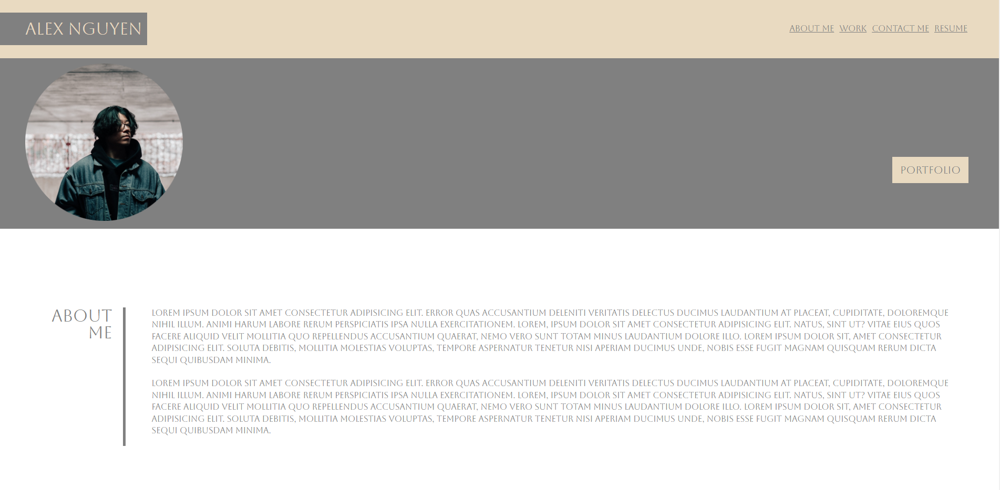

# professional-portfolio-ch-2

[Live Link](https://anguyen780.github.io/professional-portfolio-ch-2/)

## Description

 This is my portfolio showcasing my work/projects for potential employers. The purpose of this project was to incorporate all that we learned about CSS. Links are reactive and will redirect you to certain sections of the page, projects and my Git Hub page. Implementing what we learned about hover properties I have made the images in the work section hover reactive as well. This challenge was difficult but was very beneficial in applying the CSS skills we learned. 

## Usage

